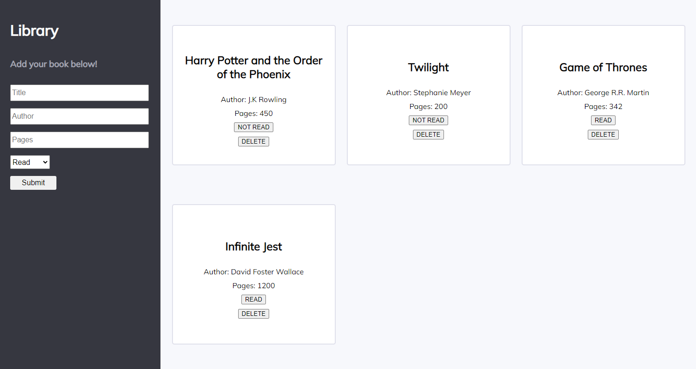

# library

Simple library manager where you can add, remove, and update books. Project completed to improve js object skills.

## Demo

[Live Demo](https://kmatic.github.io/library/)

## Built with

- HTML
- JS
- CSS

## TO-DO

- Bug fixes (form validation)
- Design changes

